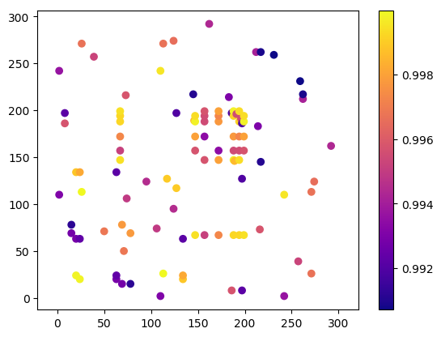

# nlp_crypto
Hobby projects to test NLP models.

A very naive practice on NLP, built for ICDIS

## ICDIS

[poster abstract submission](https://www.icdis.org/poster-competition.html)

Title: The News that Shifts the Value of Cryptocurrency

Abstract: Ever since the birth of cryptocurrency, its nature and value has been highly debated. It is the ideal digital asset in the world of internet, that is decentralized and inherently resistant to modification of the ownership. Even though the nature and value has been highly debated, the combination of security and transparency makes it one of the most important innovation in the era of ‘cloud data’, where security is the last shield of privacy. I used Doc2Vec technique to build a semantic model with archived news from the Wall Street Journal and then apply KNN model to classify the topics. The correlation of news from each topic with the same-day value change of BitCoin, one of the major cryptocurrencies, has been explored by RandomForest, in order to predict the event-driven price change. 

Cryptocurrency is a concept of digital currency in which encryption techniques are used to regular the generation and verify the transfer of funds based on blockchain, a distributed ledger that is inherently resistant to modification of the data. 

[Cryptocurrency ticket price Reference](https://blog.patricktriest.com/analyzing-cryptocurrencies-python/)


### crawl WSJ news archive


```python
import requests
from bs4 import BeautifulSoup
```

### build database to save crawled news
[pandas with SQLite](https://www.dataquest.io/blog/python-pandas-databases/)

[pandas ](https://www.ryanbaumann.com/blog/2016/4/30/python-pandas-tosql-only-insert-new-rows)

Steps
1. check if in database
2. update database
3. fetch news


```python
def archive_link(ts):
    return "http://www.wsj.com/public/page/archive-%s.html" % ts.date().isoformat()

def news_archive(ts):
    news = []
    link = archive_link(ts)
    response = requests.get(link)
    assert response.ok, link
    
    soup = BeautifulSoup(response.text, "html5lib")
    pieces = soup.find("ul", {"class":"newsItem"}).find_all('li')
    for piece in pieces:
        title = piece.find('h2').text
        url = piece.find('a')['href']
        content = piece.find('p').text
#         _, title2, content = piece.find('p').text.splitlines()
        news.append([ts, title, content, url])
    return news
#     return pd.DataFrame(news, columns=['date','title', 'content', 'url'])
```


```python
start_date = pd.datetime(2017,1,1)
end_date = pd.datetime(2017,12,31)
btc_usd_datasets.index
```


    DatetimeIndex(['2011-09-13', '2011-09-14', '2011-09-15', '2011-09-16',
                   '2011-09-17', '2011-09-18', '2011-09-19', '2011-09-20',
                   '2011-09-21', '2011-09-22',
                   ...
                   '2018-02-18', '2018-02-19', '2018-02-20', '2018-02-21',
                   '2018-02-22', '2018-02-23', '2018-02-24', '2018-02-25',
                   '2018-02-26', '2018-02-27'],
                  dtype='datetime64[ns]', name='Date', length=2360, freq='D')


```python
all_news = pd.read_csv('data/wsj_archive.gz', parse_dates=['date'])
if start_date.date() < all_news.date[0].date() or (end_date.date() > all_news.date.iloc[-1].date()):
    updates = []
    for date in set(pd.date_range(start=start_date, end=end_date, freq='D')) - set(all_news.date):
        updates += news_archive(date)
    updates = pd.DataFrame(updates, columns=['date','title', 'content', 'url'])
    all_news.append(updates).sort_values('date').to_csv('data/wsj_archive.gz', index=None, compression='gzip')
```


```python
import sqlite3
conn = sqlite3.connect("data/wsj_news.db")
cur = conn.cursor()
try:
    updates
except:
    pass
else:
    updates.to_sql('archive', conn, if_exists='append', index=False)
sql_news = pd.read_sql_query("select * from archive;", conn, parse_dates=['date'])
cur.close()
conn.close()
```

### Statistics of News data
~~03/01/2018 version~~

~~from 2011-09-13 to 2012-09-12~~ ~~67579~~

03/02/2018 version

> ~~30094	2012-02-24	The Surveillance Catalog	NaN~~	
> ~~http://www.wsj.com/articles/SB1000142405297020...~~


from 2017-01-01 to 2017-12-31

1. drop NaN value: 1
```
10593	2017-01-08	Test Your Smarts on the ‘Star Wars’ Market, Ra...	NaN	http://www.wsj.com/articles/test-your-smarts-o...
```
2. format the content
```
remove '\n' and extra space
```

3. remove duplicated: 1294 -> 1995
```
count                                    1294 -> 1995
unique                                    226 -> 72
top       Pepper...and Salt Pepper...and Salt -> ...
freq                                      306 -> 687
```

entries: 66284 -> 43268

### Sentiment analysis

#### Polarity and subjectivity
* [textblob](https://github.com/sloria/TextBlob): [train with textbolb](http://datasynce.org/2017/05/sentiment-analysis-on-python-through-textblob/)
* [twitter trained on keras](https://www.bonaccorso.eu/2017/08/07/twitter-sentiment-analysis-with-gensim-word2vec-and-keras-convolutional-networks/)

#### Topic Classification
* [Topic modeling](https://medium.com/mlreview/topic-modeling-with-scikit-learn-e80d33668730)
* [notebook for topic analysis](https://github.com/robinsones/NYTimes-and-Trump/blob/master/Trump_NYTimes_Analysis.ipynb)


```
Topic #0; Number of Article: 9022
russia election russian presidential senate putin probe campaign 2016 french sanctions intelligence party fbi investigation moscow comey interference political committee
Topic #1; Number of Article: 1086
corrections amplifications edition 2017 jan oct aug sept nov july june april march feb dec 24 26 28 17 21
Topic #2; Number of Article: 5066
gerard baker editor scoops guided stories tour point personal 10 journal wall chief best day street trump travel ban latest
Topic #3; Number of Article: 10989
trump president donald administration obama immigration order policy said elect ban mr travel secretary campaign office agenda says washington leaders
Topic #4; Number of Article: 8486
new york jersey cuomo gov art andrew times office book manhattan authority study way research zealand fiction museum shows yorkers
Topic #5; Number of Article: 4087
news media marketing advertising cmo roundup happenings today morning industry biggest ad facebook fox ads google tv digital snap youtube
Topic #6; Number of Article: 5605
tax plan overhaul gop reform republicans senate code taxes corporate cut republican cuts congress income rate pass businesses proposal budget
Topic #7; Number of Article: 3489
review outlook reform trump obama reviews obamacare gop good political labor democrats britain rule film gigot editorial needs putin growth
Topic #8; Number of Article: 5819
oil prices opec production crude energy output gas saudi week cuts rose supply drilling producers global rig rigs count stockpiles
Topic #9; Number of Article: 3836
korea north south korean missile nuclear pyongyang sanctions kim military jong threat tensions ballistic test weapons defense seoul japan launch
Topic #10; Number of Article: 8491
fed federal reserve rates rate inflation yellen raise economy policy meeting year term janet minutes officials increase short increases chairwoman
Topic #11; Number of Article: 3572
photos day editors wall journal selected street chosen sunday thursday friday tuesday wednesday monday march aug celebrate dec june india
Topic #12; Number of Article: 5389
china chinese beijing xi world jinping economy global yuan foreign market growth largest sea country hong kong communist alibaba economic
Topic #13; Number of Article: 10620
quarter earnings profit sales revenue watch growth results scheduled market fourth report second year reported closes expected fiscal know need
Topic #14; Number of Article: 5321
health care gop act affordable senate republicans insurance republican repeal law vote insurers obamacare senators medicaid overhaul legislation democrats replace
Topic #15; Number of Article: 7618
dollar gold prices data rose higher fell copper month weaker investors high level falls metals edged week gains friday lower
Topic #16; Number of Article: 8347
state islamic tillerson syria forces iraq military said iraqi attack officials killed militants secretary rex budget isis mosul california gov
Topic #17; Number of Article: 6368
brexit european eu union minister prime theresa britain europe talks british bloc negotiations deal brussels macron london political pound leaders
Topic #18; Number of Article: 6487
billion debt deal treasury buy sell auction comprising fund sold securities department previously agreed equity week firm private group stake
Topic #19; Number of Article: 11284
investors stocks market stock markets shares funds dow rally bond 500 companies fund gains emerging trading year global indexes industrial
Topic #20; Number of Article: 2591
house white republicans republican security adviser director staff gop said committee flynn ryan communications senior home rep mike press aide
Topic #21; Number of Article: 4742
best books week web selling ended data bookscan npd children gurdon meghan cox author fiction reviews sacks tom sam mysteries
Topic #22; Number of Article: 31490
company chief business executive said ceo world financial companies year firm uber group people plans says technology years car maker
Topic #23; Number of Article: 4528
court supreme judge appeals gorsuch case ban ruling travel justice federal neil ruled law bankruptcy order legal nominee justices judges
Topic #24; Number of Article: 7688
million home estate real property pay homes lists settle asks funding manhattan 100 raised agreed startup square beach raises housing
Topic #25; Number of Article: 5761
street heard wall big banks apple growth good investors main drug chip tech needs price looks tesla makers markets industry
Topic #26; Number of Article: 4747
trade free mexico canada nafta american deficit agreement surplus exports talks global imports pact administration economic canadian pacific mexican economy
Topic #27; Number of Article: 6143
bank central ecb banks policy european rate inflation monetary eurozone stimulus deutsche financial england canada bond japan draghi rates economy
Topic #28; Number of Article: 4599
government bonds bond yields treasurys prices yield strengthened debt note year pulled inflation strengthen treasury selloff data assets demand 10
Topic #29; Number of Article: 5941
city york mayor police blasio nyc council officials schools man department school mayoral public officers said housing bronx people island

```

* Interested topics:
    * 0 russia, election
    * _3 trump president_
    * 5 new media marketing
    * 6 tax plan
    * 8 oil price
    * 9 korea north
    * 10 fed federal reserve
    * 12 china chinese beijing (yuan)
    * 15 dollar gold
    * 16 state islamic
    * 17 brexit european
    * 19 investors stocks
    * 24 million home estate
    * 25 street heard wall (apple tech chip)
    * 26 trade free
    * 27 bank central
    * 28 government bonds
    
    `[0, 3, 5, 6, 8 ,9, 10, 12, 15, 16, 17, 19, 24, 25, 26, 27, 28]`

* Nonsense topics
> 1, 11, 13, 18, 21, 23, 29


```python
# exam news by topic
topic_id = ['9']
# news.content[(melted_df.value[melted_df.Topic_Num == topic_id]==1.0).values].sample(5) # same
news.content[article_topics.loc[:,topic_id].sum(axis=1)>0].sample(5)
```

    20525    South Korea: Stance on U.S. Missile-Defense System Hasn’t Shifted A top South Korean national-security official sought to tamp down concerns about the government’s commitment to a controversial U....
    12577                                                               Could a Faltering Shinzo Abe Achieve All This? The office of Japan’s prime minister responds to worries that Mr. Abe may be losing momentum.
    18901    U.S. Plans Missile Defense Test Amid Concern Over North Korea The Pentagon is planning to conduct a test next week of a system designed to shoot down intercontinental missiles, U.S. defense offici...
    31455    J.P. Morgan Pledges Increased Support for Chicago J.P. Morgan Chase has pledged $40 million to help ailing neighborhoods on Chicago’s south and west sides, following a similar model it applied in ...
    14274    North Korean Nuclear Threat Fuels Outsider’s Election Hopes in South Hong Joon-pyo has found hope in escalating tensions with Pyongyang over its nuclear program that have changed the dynamics of t...
    Name: content, dtype: object


### Explore News sentiment

```python
news.sample(5).loc[:, ['date','title','polarity','subjectivity']]
```


<div>
<style scoped>
    .dataframe tbody tr th:only-of-type {
        vertical-align: middle;
    }

    .dataframe tbody tr th {
        vertical-align: top;
    }

    .dataframe thead th {
        text-align: right;
    }
</style>
<table border="1" class="dataframe">
  <thead>
    <tr style="text-align: right;">
      <th></th>
      <th>date</th>
      <th>title</th>
      <th>polarity</th>
      <th>subjectivity</th>
    </tr>
  </thead>
  <tbody>
    <tr>
      <th>39473</th>
      <td>2017-11-21</td>
      <td>Mugabe Resigns as Zimbabwe’s Leader After 37 Y...</td>
      <td>-0.127778</td>
      <td>0.194444</td>
    </tr>
    <tr>
      <th>39784</th>
      <td>2017-11-24</td>
      <td>For the Pope’s Trip in Asia, a Delicate Balance</td>
      <td>-0.150000</td>
      <td>0.500000</td>
    </tr>
    <tr>
      <th>39830</th>
      <td>2017-11-25</td>
      <td>As Risk of War Looms, South Korea Weighs Chang...</td>
      <td>0.012500</td>
      <td>0.200000</td>
    </tr>
    <tr>
      <th>10860</th>
      <td>2017-03-23</td>
      <td>Document: Russia Uses Rigged Polls, Fake News ...</td>
      <td>-0.156250</td>
      <td>0.281250</td>
    </tr>
    <tr>
      <th>37461</th>
      <td>2017-11-03</td>
      <td>Fortress Hires Deutsche Hedge Fund Team Amid L...</td>
      <td>0.100000</td>
      <td>0.366667</td>
    </tr>
  </tbody>
</table>
</div>


```python
news[news.polarity < np.percentile(news.polarity, 1)].content.sample(3)
```


    2036                                                        Tomlin Calls Brown’s Postgame Video ‘Selfish’ The Steelers coach expresses regret over Facebook post that caught Tomlin disparaging Patriots
    34279                                                                                         It’s Time to End Ineffective And Cruel Animal Testing Testing drugs on animals is notoriously ineffective.
    9694     Process of Probate Is Used Often for Planned Estates Probate gets a bad name based on the relatively few estates that go through ugly and sometimes years-long will contests in probate courts.
    Name: content, dtype: object


```python
news[news.polarity > np.percentile(news.polarity, 99)].content.sample(3)
```


    15364    Verizon Invests in Self-Driving Car Startup Renovo Verizon has invested in Renovo Auto, an autonomous-vehicle tech startup best known for turning a vintage DeLorean into a self-driving car.
    17542                      Beware the CEO Who Doesn’t Win an Award A study finds that chief executives who don’t win awards, while their rivals do, often go on to make acquisitions of dubious value.
    10                                                             Using Houseplants to Say ‘Welcome Home’ Plants can lend a calming nature to your home decor. Here’s how to pull off the look, artfully.
    Name: content, dtype: object


### Compare with BitCoin News


### Correlation with sentiment


### Doc2Vec on News

[Doc2Vec brief](https://medium.com/scaleabout/a-gentle-introduction-to-doc2vec-db3e8c0cce5e)

Word vector
* [pretrained wiki & associated press](https://github.com/jhlau/doc2vec)


Corpus
* established
    * [nltk](http://www.nltk.org/nltk_data/)
    * [wiki](https://radimrehurek.com/gensim/wiki.html)
    
* customized
    * [google news archive](https://news.google.com/newspapers)
    * [news API](https://newsapi.org/docs)
	* [wsj news archive](http://www.wsj.com/public/page/archive-2018-1-03.html)
	* [google trends](https://trends.google.com/trends/)
	* [intrinio](http://blog.intrinio.com/news-api-get-latest-news-stocks/)
    

[codecs.open()](https://docs.python.org/2/library/codecs.html):  Open an encoded file using the given mode and return a wrapped version providing transparent encoding/decoding. 

[word2vec vs doc2vec](https://www.quora.com/What-is-doc2vec):
* While Word2Vec computes a feature vector for every word in the corpus, Doc2Vec computes a feature vector for every document in the corpus.
* While Word2Vec works on the intuition that the word representation should be good enough to predict the surrounding words, the underlying intuition of Doc2Vec is that the document representation should be good enough to predict the words in the document.

* Distributed Bag of Words and The skip gram model. One involves predicting the context words using a centre word, while the other involves predicting the word using the context words. 


[Resources: DL4J](https://deeplearning4j.org/word2vec.html#doc2vec--other-nlp-resources)


### using Doc2Vec


```python
ind = 5000
print(pairs[0][ind], '\t', news.content[pairs[0][ind]])
print(pairs[1][ind], '\t', news.content[pairs[1][ind]])
```

    23 	 Riders and Residents Greet Second Avenue Subway’s Opening The new Second Avenue Subway was greeted on Monday by Upper East Side residents who welcomed the end of construction and riders who looked forward to easier, less-congested commutes.
    119 	 Alcoa to Permanently Close Suriname Alumina Refinery and Bauxite Mines Alcoa will permanently close the Suralco alumina refinery and bauxite mines in Suriname, which were fully curtailed in November 2015 amid a limited bauxite supply and unfavorable market conditions.


```python
for ind, n in Counter(pairs[0]).most_common(4):
    print('news id:', ind ,'\t' ,n ,'times','\t' , news.content[ind])
```

    news id: 21 	 288 times 	 North Korea Close to Intercontinental Missile Test Kim Jong Un said his country is finalizing preparations for a test launch of an ICBM, which would mark an advance in its attempt to build a nuclear weapon capable of reaching the U.S.
    news id: 193 	 287 times 	 A Mediterranean-Style Villa in Larchmont, N.Y. This 1920s stone house has an original tile roof and a solarium.
    news id: 231 	 287 times 	 The 10-Point: Gerard Baker on Republicans Taking the Reins, Luxury Rents, Retirement Plans and More A personal, guided tour to the best scoops and stories every day in The Wall Street Journal, from Editor in Chief Gerard Baker.
    news id: 259 	 286 times 	 The 10-Point: Gerard Baker on a House Divided and United, Trump’s Car Clashes and More A personal, guided tour to the best scoops and stories every day in The Wall Street Journal, from Editor in Chief Gerard Baker.


```python
# like pairs
like_mask = (tfidf_Tcorr<1) & (tfidf_Tcorr>0.99)
like_pairs = np.where(like_mask)
# Counter(like_pairs[0])
```


```python
scatter(like_pairs[0], like_pairs[1], c=tfidf_Tcorr.values[like_mask], cmap='plasma')#, vmax=1)
axis('equal')
xlim([0,300])
colorbar()
```


    <matplotlib.colorbar.Colorbar at 0x15c849128>




```python
ind = 2
print(like_pairs[0][ind], '\t', news.content[like_pairs[0][ind]])
print(like_pairs[1][ind], '\t', news.content[like_pairs[1][ind]])
```

    8 	 China Tries to Recalibrate Credit Chinese officials need to tread carefully in the coming months to tighten monetary conditions, curb risky investment practices and keep the yuan from depreciating too far while keeping China’s economy healthy.
    186 	 Boutique Hotels Bet on China Even as Nation’s Glut of Rooms Worsens Flashy hotels targeting the young and hip see opportunity in China even as the country is experiencing an overall glut of hotels that has reduced average room rates.


```python
# Heatmap for save 
figure(figsize=(8,8))
scatter(pairs[0], pairs[1], marker='x', alpha=0.5, c=tfidf_Tcorr.values[mask], cmap='plasma')#, vmax=1)
scatter(like_pairs[0], like_pairs[1], marker='o', facecolors=None, alpha=0.5, c=tfidf_Tcorr.values[like_mask], cmap='plasma')#, vmin=min(wiki_Tcorr.min()))
legend(['unlike pairs','like pairs'], loc=1)
imshow(tfidf_Tcorr, cmap='viridis')
colorbar()
title("Pearson Correlation bewteen First 300 News from Topic Modeling")
savefig('fig/tfidf.jpeg', dpi=200, bbox_inches='tight')
```


### Retopics


```python
from sklearn.decomposition import PCA
```


```python
%time m_pca = PCA(n_components=30, random_state=1).fit(wiki300)
%time pca_transformed_data = m_pca.transform(wiki300)
pca_transformed_data = pd.DataFrame(pca_transformed_data)
scores = m_pca.score_samples(wiki300)
print("pca_transformed_data.shape", pca_transformed_data.shape)
```

    CPU times: user 2 s, sys: 431 ms, total: 2.43 s
    Wall time: 1.56 s
    CPU times: user 174 ms, sys: 21.5 ms, total: 196 ms
    Wall time: 129 ms
    transformed_data.shape (43268, 30)


```python
pca_topics = pd.DataFrame(scores.round() % 30)
pca_topics.columns = ["Topic_Num"]
pca_topics["Date"] = news.date
```


```python
topic_id = [0]
news.content[pca_topics.Topic_Num == topic_id].sample(5)
```


    21509    Seven U.S. Sailors Missing After Navy Destroyer Collides With Ship A U.S. destroyer severely damaged in a collision with a cargo vessel off the coast of Japan reached port as the Japanese and U.S....
    9048     The Grand Piano: More Than a Nouveau-Riche Cliché Don’t dismiss the poor instrument—hijacked by the nouveau riche to expediently telegraph status and taste. Its inherent beauty shines even brighte...
    24554    Lawmakers Can Spend Campaign Cash on Home Security, Agency Says Following a shooting in June that critically injured a senior House Republican, lawmakers may spend campaign funds on home security ...
    30229    Returning Lawmakers Face a Tough Agenda With Little Margin for Error After a summer recess, Congress must grapple with keeping the federal government open, paying U.S. creditors and passing a hurr...
    19130    Trump Looks to Get Past ‘Side Issues’ President Trump met privately with top advisers as he considered changes aimed at resetting the direction of an administration beset by expanding probes into ...
    Name: content, dtype: object


### Explore Results

1. unsupervised
    1. DBSCAN: mark outlier
    2. ~~MeanShift: determine number of topics, slow~~

2. dimension reduction 
    1. PCA
3. classification
    1. TSNE: get labels
4. remove features
    1. RF: feature importance
    
5. verification
    1. KNN: train to predict on other news
    2. MLP
    3. GP

### Procedure
1. build word vector from established corpus
2. vectorize wsj news using word vector
3. ~~KNN to classify topics/PCA to identify topics~~
4. build panic metrics (disaster…), sentiment analysis
5. check correlation with precentage change in cryptocurrency

or
1. load established word vector
2. doc2vec training on news corpus
3. infer on wsj archived news
4. ~~KNN to check topic separation~~
5. build panic metrics (disaster…), sentiment analysis
6. check correlation with precentage change in cryptocurrency


```python
news.content.head(n)[y_DB==-1].sample(2)
```


    719    Trump, Transition Team Won’t Meet With Taiwanese President During U.S. Visits An official with President-elect Donald Trump’s transition team said neither Mr. Trump nor transition officials would ...
    721    Shopping for Vintage Fashion: How the Internet Has Transformed It A guide to navigating the online vintage marketplace—a far cry from the dusty basement boutiques of old—and hunting down historic ...
    Name: content, dtype: object


```python
news.content.head(n)[y_DB==0].sample(2)
```


    2676                                                                                                                                 Greater New York Watch A roundup of news from across the tri-state region.
    7551    What Would a Le Pen Victory in France Mean for the Euro? National Front candidate Marine Le Pen has said she would pull her country, one of the European Union’s founding nations, out of the common...
    Name: content, dtype: object


[correlation matrxi visualization](https://datascience.stackexchange.com/questions/10459/calculation-and-visualization-of-correlation-matrix-with-pandas)


